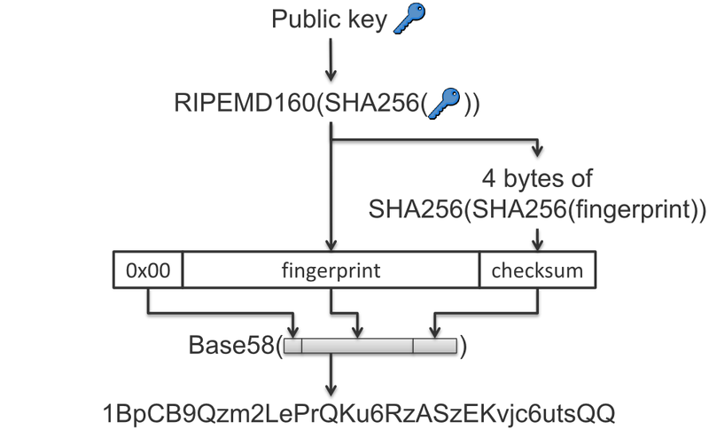
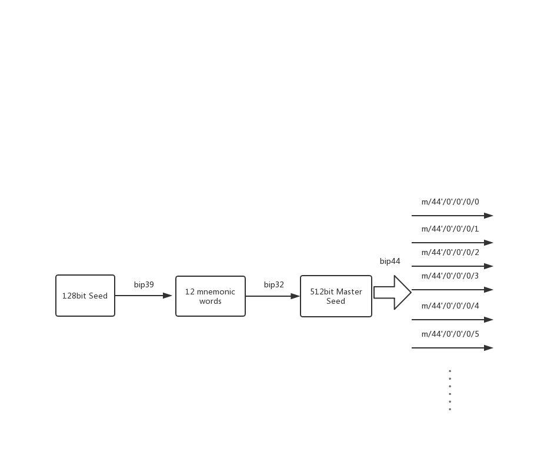

# js中使用的第三方库

* bip39.js

通过随机数种子产生助记词，和通过助记词产生得到随机数种子。

* wordlist.js

具体的助记词列表

* bitcore-lib.js

比特币的库，主要功能有：通过私钥产生公钥，通过公钥产生地址，HD钱包功能，签名原始交易等。

* ethereumjs-wallet-hd-0.6.0.js

以太坊 HD 钱包的实现

* sample-ecdsa.js

secp256k1 的js实现，主要用来签名用户登录时的随机数

* sjcl.js

加密算法 aes-gcm-128 的实现

* web3.min.js

以太坊的常用功能和RPC接口

# 用到的 Rust 库

* bitcoin

提供对比特币的交易签名，输入输出脚本的构建等功能

* bitcoin_hash

ripemd160, sha256 等哈希算法

* secp256k1

比特币和以太坊都使用的签名算法

* tiny-bip39

产生助记词和随机种子

* tiny-hderive

通过从bip39产生的助记词和随机种子产生 secp256k1 的私钥

* ethsign

通过 tiny-hderive 产生的私钥得到公钥，公钥产生地址

* hex

16 进制字符串转换工具

* ethereum-tx-sign

以太坊交易签名工具

* ethereum-types

以太坊 parity实现中用到的一些类型


# C 接口

__Note__: 以下C 接口中使用的所有字符串必须是16进制字符串

## 比特币


``` C
// 功能: 构造p2pkh脚本
// 参数： address - 比特币地址
//        script_pubkey - 返回对应该地址的p2pkh脚本
int32_t btc_build_pay_to_pub_key_hash(const char *address, char **script_pubkey);

// 功能: 从一个地址的私钥签名交易
// 参数： address - 花费比特币的地址
//        pirv_key - 该地址对应的私钥
//        input - 未花费输出，格式为： "txid:vout", "b59e6f24e6fcf4d8a396a8b9f92ccf83d242cc6ce3295ae024f8d58627f30cc5:0"
//        output - 比特币转账输出，格式为： "script:value", "76a91402245e1265ca65f5ab6d70289f7bcfed6204810588ac:1000000
//        raw_tx - 可以发送到比特币网络的原始交易
//        tx_hash - 交易哈希

int32_t btc_build_raw_transaction_from_single_address(const char *address,
                                                      const char *priv_key,
                                                      const char *input,
                                                      const char *output,
                                                      char **raw_tx,
                                                      char **tx_hash);

// 功能： 通过助记词得到 root_xpriv 和 随机种子
// 参数： mnemonic - 助记词
//       network - 使用的网络，主网还是测试网
//       language - 语言， 默认为英文
//       pass_phrase - 对助记词的保护密码，一般不设置
//       root_xpriv - hd 钱包根私钥
//       root_seed - 随机种子
int32_t btc_from_mnemonic(const char *mnemonic,
                          const char *network,
                          const char *language,
                          const char *pass_phrase,
                          char **root_xpriv,
                          char **root_seed);

// 功能： 通过随机种子得到根私钥
// 参数： seed - 随机种子
//       network - 使用的网络，主网还是测试网
//       language - 语言， 默认为英文
//       root_xpriv - hd钱包根私钥
int32_t btc_from_seed(const char *seed,
                      const char *network,
                      const char *language,
                      char **root_xpriv);

// 功能：产生hd钱包
// 参数： network - 使用的网络，主网还是测试网
//       language - 语言， 默认为英文
//       pass_phrase - 对助记词的保护密码，一般不设置
//       root_xpriv - 根私钥
//       mnemonic - 产生的助记词
int32_t btc_generate(uint32_t strength,
                     const char *network,
                     const char *language,
                     const char *pass_phrase,
                     char **root_xpriv,
                     char **mnemonic);

// 功能： 根据根私钥得到某个index对应的私钥
// 参数： index - 地址编号
//        root_xpriv - 根私钥
//        priv_key - 对应的私钥
int32_t btc_private_key_of(uint32_t index, const char *root_xpriv, char **priv_key);


// 功能： 根据私钥得到对应的btc地址
// 参数： network - 使用的网络，主网还是测试网
//       priv_key - 比特币私钥
//       address - 对应的比特币地址
int32_t btc_to_address(const char *network, const char *priv_key, char **address);
```

## 以太坊

```C
// 功能： 从助记词产生eth钱包
// 参数： mnemonic - 助记词
//       language - 语言， 默认为英文
//       address - hd钱包第一个地址
//       priv_key - hd钱包第一个地址的私钥
//       master_seed - 随机种子
int32_t eth_from_mnemonic(const char *mnemonic,
                          const char *language,
                          char **address,
                          char **priv_key,
                          char **master_seed);

// 功能： 随机产生一个以太坊hd钱包
// 参数： language - 语言， 默认为英文
//        address - hd钱包第一个地址
//        priv_key - hd钱包第一个地址的私钥
//        master_seed - 随机种子
//        mnemonic - 助记词
int32_t eth_generate(uint32_t strength,
                     const char *language,
                     char **address,
                     char **priv_key,
                     char **master_seed,
                     char **mnemonic);

// 功能： 根据index选择hd钱包中的一个地址
// 参数： language - 语言， 默认为英文
//       master_seed - 随机种子
//       index - 选择哪一个地址
//       address - 选择的地址
//       priv_key - 地址对应的私钥
int32_t eth_select_wallet(const char *language,
                          const char *master_seed,
                          uint32_t index,
                          char **address,
                          char **priv_key);

// 功能： 签名原始交易
// 参数： nonce - 每个以太坊地址的随机数
//       to - 要转账到哪个地址
//       value - 转账数量
//       gas - 最大消耗的矿工费
//       gas_price - 每个gas的单价
//       data - 转账备注信息或者合约调用数据
//       priv_key - 发起转账的地址私钥
//       tx_hash - 交易哈希
//       serialized - 序列化之后的交易，可以直接发送到以太坊网络
int32_t eth_sign_raw_transaction(uint8_t chain_id,
                                 const char *nonce,
                                 const char *to,
                                 const char *value,
                                 const char *gas,
                                 const char *gas_price,
                                 const char *data,
                                 const char *priv_key,
                                 char **tx_hash,
                                 char **serialized);

// 功能： 通过助记词得到第一个地址的公钥
// 参数： mnemonic - 助记词
//       language - 语言， 默认为英文
//       public_key - 第一个地址对应的公钥，这里使用的是以`04`开头的非压缩公钥 (https://bitcointalk.org/index.php?topic=644919.0)
int32_t get_public_key_by_mnemonic(const char *mnemonic, const char *language, char **public_key);
```

## 密码相关

```C
// 功能：aes-gcm-128 解密
// 参数： key - 128位私钥
//       nonce - 随机数
//       aad - 额外数据，一般这个参数位空
//       cipher_text - 要解密的密文
//       out_plain_text - 解密输出的明文
int32_t rust_decrypt(const char *key,
                     const char *nonce,
                     const char *aad,
                     const char *cipher_text,
                     char **out_plain_text);

// 功能： aes-gcm-128 加密
// 参数： key - 128位私钥
//       nonce - 随机数
//       aad - 额外数据，一般这个参数位空
//       plain_text - 要加密的明文
//       out_cipher_text - 加密之后的密文
int32_t rust_encrypt(const char *key,
                     const char *nonce,
                     const char *aad,
                     const char *plain_text,
                     char **out_cipher_text);


// 功能： 计算 sha256 哈希
// 参数： data - 要进行哈希的数据
//       hash - hash 结果
int32_t rust_sha256(const char *data, char **hash);


// 功能： secp256k1 签名
// 参数： priv_key- 私钥
//       msg - 要签名的数据的256位哈希
//       signature - 签名输出
int32_t rust_sign(const char *priv_key, const char *msg, char **signature);
```

# js 调用接口

js 调用 C 接口都通过传递字16进制字符串实现。C 层暴露的接口均通过 `api` 命名空间暴露到高层。例如调用计算sha256哈希的算法。

```js

api.cipher.rust_sha256(data)

```

# 关键算法和流程

## 比特币以太坊地址生成

### 比特币地址生成


1. 根据私钥计算出压缩公钥
2. ripemd160(sha256(压缩公钥))
3. 计算checksum = sha256(sha256(上一步结果)).slice(0, 4)
4. 0x00 || 第二步结果 || 第三步结果
5. base58_check(第四步结果)

### 以太坊地址生成

1. 使用密码学安全的随机数产生算法生成32字节随机数作为私钥
2. 使用secp256k1算法将上一步产生的私钥计算出64字节的公钥
3. 计算公钥的 keccak 哈希
4. 截取 keccak 哈希结果的最后20字节作为以太坊地址

## 签名比特币和以太坊交易的流程

### 比特币 (源码: btc_build_raw_transaction_from_single_address )

1. 构造花费输入，包括上一笔交易的 `txid` 和输出序号 `vout`
2. 根据转账地址判断转账类型，构造输出脚本，列入p2pkh 脚本
3. 根据签名类型(我们采用默认的 SIGHASH_ALL)，计算每个输入的的签名哈希
4. 根据步骤3计算出来的哈希签名每一个输入
5. 将签名内容填充到输入脚本中
6. 按照比特币的网络传输格式序列化交易，就是我们最终发送到比特币网络中的交易内容

### 以太坊 (源码: eth_sign_raw_transaction)

1. 输入参数
chain_id - 主链还是测试链
nonce - 每个账号的随机数
to - 被转入账户的地址
value - 转账金额
gas - 最高gas消耗
gas_price - gas 价格
data - 额外数据或者智能合约调用数据
priv_key - 私钥

2. 采用 Rlp 编码对交易进行序列化
```rust
fn encode(&self, s: &mut RlpStream) {
    s.append(&self.nonce);
    s.append(&self.gas_price);
    s.append(&self.gas);
    if let Some(ref t) = self.to {
        s.append(t);
    } else {
        s.append(&vec![]);
    }
    s.append(&self.value);
    s.append(&self.data);
}
```

3. 计算签名哈希
```rust
fn hash(&self, chain_id: u8) -> Vec<u8> {
    let mut hash = RlpStream::new(); 
    hash.begin_unbounded_list();
    self.encode(&mut hash);
    hash.append(&mut vec![chain_id]);
    hash.append(&mut U256::zero());
    hash.append(&mut U256::zero());
    hash.complete_unbounded_list();
    keccak256_hash(&hash.out())
}
```

4. 对交易签名并计算交易哈希
```rust
pub fn sign(&self, private_key: &H256,chain_id : &u8) -> (Vec<u8>, Vec<u8>) {
    let hash = self.hash(*chain_id);
    let sig = ecdsa_sign(&hash, &private_key.0, &chain_id);
    let mut tx = RlpStream::new();
    tx.begin_unbounded_list();
    self.encode(&mut tx);
    tx.append(&sig.v);
    tx.append(&sig.r);
    tx.append(&sig.s);
    tx.complete_unbounded_list();

    let serialized = tx.out();
    // return txhash and serilized tx
    (keccak256_hash(&serialized), serialized)
}
```

## 助记词的生成方法(bip39)

### 以128位随机数生成12个助记词为例:
1. 随机生成128位(16bytes)的熵
2. 计算熵的sha256哈希，取结果的 128 / 32 位 作为checksum
3. 将checksum追加到128位熵后面，此时总共 132 位
4. 将第三步得到的结果没11位划分，总共可以得到12组
5. 查询2048个助记词列表，得到12个助记词

### 助记词转换为 512 位seed

采用pbkdf2-sha512(key = 密码, data = 助记词, round = 2048) 计算出512位哈希

## hd钱包的原理(bip32)

### 主私钥和主链码

从bip39中得到512位seed, 计算 HMAC-SHA512(key = "Bitcoin seed", Data = seed) 得到512位的值，左边256位为主私钥，右边256位位主链码

### 扩展私钥和扩展链码

计算方法为： HMAC-SHA512(Key = 父链码, Data = 父私钥), 左边256位加上父私钥对椭圆曲线的阶取模得到扩展私钥, 右边256位为扩展链码

### 扩展私钥和公钥的序列化格式

4 byte: 版本号 (mainnet: 0x0488B21E public, 0x0488ADE4 private; testnet: 0x043587CF public, 0x04358394 private)
1 byte: 继承的子私钥的深度，最大256
4 bytes: 父密钥的指纹, 如果为主私钥默认为0x00000000
4 bytes: 子密钥编号, 0-2^31 - 1 为常规私钥， 2^31 - 2^32 -1 为加固私钥, 如果是主私默认为0x00000000
32 bytes: 链码
33 bytes: 公钥或者私钥

将以上78字节数据进行base58编码就可以得到主网的扩展私钥和扩展公钥以 `xprv` 和 `xpub` 开头，测试网的扩展私钥以 `tprv` 和 `tpub` 开头

## 多币种钱包(bip44)

bip32协议解决了钱包公私钥的管理问题，bip44协议解决了多个币种钱包的共享问题。

### 五级结构

m / purpose' / coin_type' / account' / change / address_index

#### purpose

这个字段一般固定为 44, 表示这个扩展私钥的继承方式遵循bip44协议

#### coin_type

表示代币的注册编号, 注册编号可以在[这里](https://github.com/satoshilabs/slips/blob/master/slip-0044.md)查询, 比特币编号为0, 以太坊编号为60

#### account

类似银行账号，每个用户可以有多个

#### change

一般的, 如果允许让外界查询到这个地址的信息则为0, 如果不希望外界查询到则为1

#### address_index

地址编号, 由bip32协议使用

## bip32, bip39 和 bip44 协议之间的关系



# 参考资料

1. [如何手动签名一笔比特币交易](https://klmoney.wordpress.com/bitcoin-dissecting-transactions-part-2-building-a-transaction-by-hand/)
2. [生成比特币地址的步骤](https://en.bitcoin.it/wiki/Technical_background_of_version_1_Bitcoin_addresses)
3. [bip39 如何生成助记词](https://github.com/bitcoin/bips/blob/master/bip-0039.mediawiki)
4. [bip44 助记词的继承路径](https://github.com/bitcoin/bips/blob/master/bip-0044.mediawiki)
5. [bi32 hd钱包的产生方法](https://github.com/bitcoin/bips/blob/master/bip-0032.mediawiki)
6. [bip39 参考实现](https://github.com/infincia/bip39-rs)
7. [bip32 参考实现](https://docs.rs/crate/bitcoin/0.18.0/source/src/util/bip32.rs)
8. [bip39在线测试网站](https://iancoleman.io/bip39/)